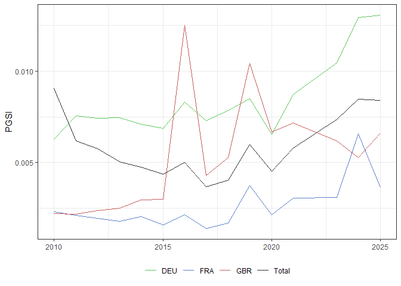
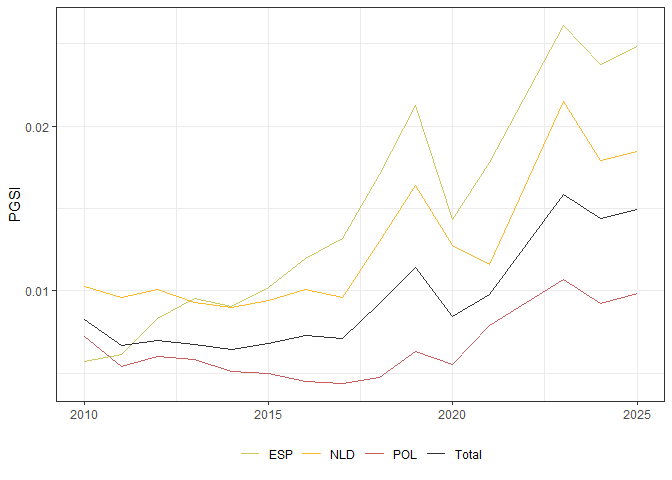
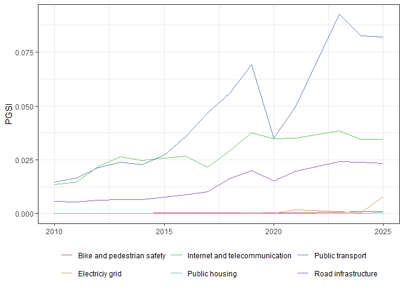
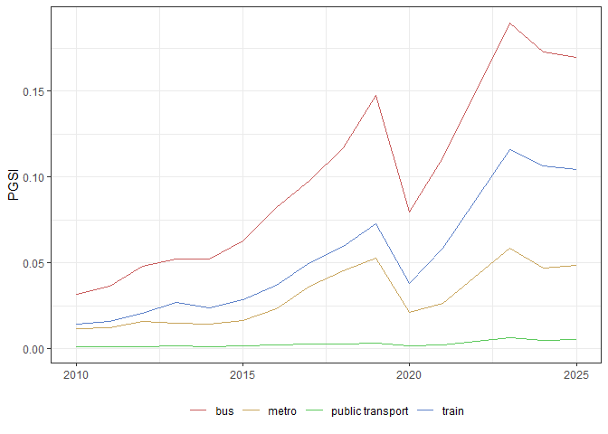
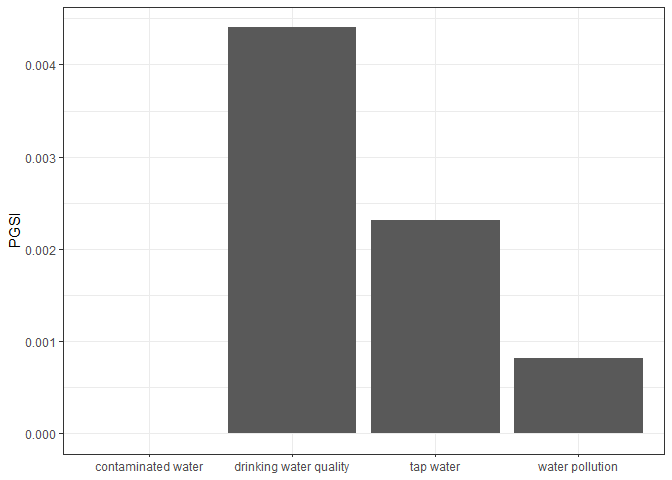
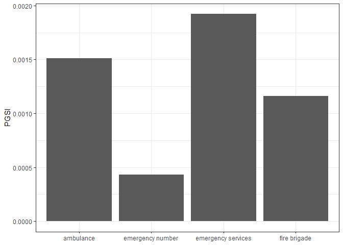

# globaltrends Public Goods Search Index (PGSI)

The **globaltrends PGSI** is based on individual-level issue salience
using data from [Google Trends](https://trends.google.com/trends/). Our
concept provides a bottom-up complement to established measures that
focus more on the quality of infrastructure, service provision, or
environmental resources. The **globaltrends PGSI** can serve to predict
demands regarding or dissatisfaction about public goods in a country
voiced by a popular majority of individuals. In contrast to existing
measures, the **globaltrends PGSI** measure captures issue salience
directly among individuals rather than media or analyst reports. As
such, it is uniquely representative of socio-political sentiment
regarding public goods, timely, and widely available. Our concept and
measure offer novel opportunities for economics, political science, and
management researchers.

The current version of the **globaltrends PGSI** dataset can be accessed
in different file formats:

- Granuar data (location-month-term)
  - [PARQUET](https://github.com/ha-pu/globaltrends_valpop/blob/main/data/valpop_pgsi.parquet)
- Aggregated data (location-month-category)
  - [PARQUET](https://github.com/ha-pu/globaltrends_valpop/blob/main/data/valpop_pgsi_agg.parquet)
  - [XLSX](https://github.com/ha-pu/globaltrends_valpop/blob/main/data/valpop_pgsi_agg.xlsx)

The **globaltrends PGSI** is part of the [globaltrends
project](https://github.com/ha-pu/globaltrends).

- Last update of the data: 2026-01-18
- Coverage of the data: 2010-2025

# Index construction

## Index structure

The index uses a set of search
[topics](https://web.archive.org/web/20230117193147/https://support.google.com/trends/answer/4359550/)
related to various public goods to collect data on the salience of
public goods in multiple countries. The full list of
[topics](https://github.com/ha-pu/globaltrends_valpop/blob/main/input/valpop_topics.xlsx)
and
[countries](https://github.com/ha-pu/globaltrends_valpop/blob/main/input/valpop_countries.xlsx)
is available in the repository. The usage of topics instead of
plain-language terms avoids issue related to translations or ambiguous
meaning. Google’s classification algorithm assigns search queries to
these topics. This separates search queries for *party* in the
social-gathering sense from *party* in the sense of a political group.

Search terms are categories in five broad groups (with sub-categories):

1.  Environmental public goods
2.  Health-related public goods
3.  Infrastructure-related public goods
4.  Cultural public goods
5.  Governance and civic participation

The category *Environmental public goods*, for example, consists of the
sub-categories (1) Clean air, (2) Clean water, (3) Green spaces, and (4)
Waste management. The sub-category *Clean air*, in turn, consists of the
following search topics:

- air pollution
- air quality index
- smog
- dust

In addition, the **PGSI** tracks interest in EU institutions for each
country:

- European Union
- European Commission
- European Parliament
- Court of Justice of the European Union

## Search-score releveling

The Google Trends platform does not provide raw search counts, but
rather relative search volumes, which are first calculated by dividing
the number of searches for a keyword by the total searches for a given
location and time, and then normalized by the maximum search volume
within each keyword batch. This normalization, however, makes direct
comparisons across different batches, locations, or time periods
difficult due to its dependency on the specific keywords included.

To address this, we apply a releveling process to adjust all search
volumes to a common benchmark using a control keyword, ensuring that
data from different batches are comparable. We calculate comparable
search scores, which divide the search volumes of a keyword by the sum
of volumes for a set of control keywords (see
[here](https://github.com/ha-pu/globaltrends_valpop/blob/main/input/valpop_topics.xlsx))
that approximate baseline search traffic. The resulting search scores
are independent of batch, location, and time, enabling fair and
meaningful comparisons of search interest across diverse keywords,
countries, and timeframes.

## Additional data

The index also provides data on related search terms for each
topic-country-year and search regions for each topic-country-year. This
data offers further insights into the context in which searches are made
and where these searches are concentrated within countries.

# Data samples

## Data structure

Ten random rows from the aggregated **PGSI** dataset for France:

| iso3 | iso2 | category_1 | category_2 | year | date | pgsi |
|:---|:---|:---|:---|---:|:---|---:|
| FRA | FR | Governance and civic participation | Civic participation | 2015 | 2015-10-01 | 0.0000000 |
| FRA | FR | Health-related public goods | Emergency services | 2012 | 2012-06-01 | 0.0002531 |
| FRA | FR | Governance and civic participation | Access to justice | 2018 | 2018-07-01 | 0.0003457 |
| FRA | FR | Health-related public goods | Mental health support | 2025 | 2025-11-01 | 0.0002176 |
| FRA | FR | Infrastructure-related public goods | Bike and pedestrian safety | 2014 | 2014-01-01 | 0.0002838 |
| FRA | FR | Health-related public goods | Public healthcare system | 2012 | 2012-04-01 | 0.0007861 |
| FRA | FR | Health-related public goods | Emergency services | 2017 | 2017-04-01 | 0.0005864 |
| FRA | FR | EU Institutions | EU Institutions | 2025 | 2025-06-01 | 0.0029383 |
| FRA | FR | Governance and civic participation | Access to justice | 2018 | 2018-11-01 | 0.0003864 |
| FRA | FR | Cultural public goods | Cultural heritage | 2018 | 2018-07-01 | 0.0016357 |

Ten random rows from the granular **PGSI** dataset for Germany:

| iso3 | iso2 | category_1 | category_2 | topic | year | date | pgsi |
|:---|:---|:---|:---|:---|---:|:---|---:|
| DEU | DE | Environmental public goods | Clean air | smog | 2010 | 2010-06-01 | 0.0001499 |
| DEU | DE | Cultural public goods | Cultural heritage | cultural heritage | 2017 | 2017-03-01 | 0.0000000 |
| DEU | DE | EU Institutions | EU Institutions | european parliament | 2020 | 2020-04-01 | 0.0007798 |
| DEU | DE | Infrastructure-related public goods | Public transport | train | 2024 | 2024-09-01 | 0.0721017 |
| DEU | DE | Infrastructure-related public goods | Public housing | affordable housing | 2015 | 2015-04-01 | 0.0000000 |
| DEU | DE | Cultural public goods | Public service broadcasting | public radio | 2020 | 2020-06-01 | 0.0000000 |
| DEU | DE | Infrastructure-related public goods | Public housing | affordable housing | 2010 | 2010-05-01 | 0.0000000 |
| DEU | DE | Governance and civic participation | Civic participation | public consultation | 2021 | 2021-02-01 | 0.0000000 |
| DEU | DE | Infrastructure-related public goods | Electriciy grid | power outage | 2023 | 2023-10-01 | 0.0055318 |
| DEU | DE | Infrastructure-related public goods | Road infrastructure | road damage | 2015 | 2015-09-01 | 0.0000000 |

Ten random rows from the related search-term **PGSI** dataset for
Austria:

| iso3 | iso2 | category_1 | category_2 | topic | related_topic | year | related_pgsi |
|:---|:---|:---|:---|:---|:---|---:|---:|
| AUT | AT | Health-related public goods | Emergency services | emergency number | rettung | 2013 | 6 |
| AUT | AT | Infrastructure-related public goods | Internet and telecommunication | mobile phone signal | nokia | 2014 | 7 |
| AUT | AT | Infrastructure-related public goods | Road infrastructure | roads | aa route planner | 2013 | 1 |
| AUT | AT | Infrastructure-related public goods | Internet and telecommunication | mobile phone signal | iphone | 2024 | 8 |
| AUT | AT | Health-related public goods | Emergency services | ambulance | ambulanz nummer | 2015 | 4 |
| AUT | AT | Governance and civic participation | Freedom of information | open data | opendata | 2013 | 15 |
| AUT | AT | Infrastructure-related public goods | Electriciy grid | power outage | kärnten stromausfall | 2024 | 2 |
| AUT | AT | Infrastructure-related public goods | Public transport | train | bahn | 2014 | 5 |
| AUT | AT | Cultural public goods | Public service broadcasting | public broadcaster | bayern rundfunk | 2010 | 2 |
| AUT | AT | Environmental public goods | Clean air | smog | china smog | 2017 | 9 |

Ten random rows from the search region **PGSI** dataset for Italy:

| iso3 | iso2 | category_1 | category_2 | topic | year | region_code | region_name | region_pgsi |
|:---|:---|:---|:---|:---|---:|:---|:---|---:|
| ITA | IT | Infrastructure-related public goods | Road infrastructure | road damage | 2016 | IT-42 | Liguria | 0 |
| ITA | IT | Infrastructure-related public goods | Road infrastructure | roads | 2015 | IT-77 | Basilicata | 94 |
| ITA | IT | Cultural public goods | Cultural heritage | cultural heritage | 2021 | IT-72 | Campania | 72 |
| ITA | IT | Environmental public goods | Clean water | tap water | 2013 | IT-75 | Apulia | 13 |
| ITA | IT | EU Institutions | EU Institutions | european union | 2017 | IT-55 | Umbria | 52 |
| ITA | IT | Governance and civic participation | Civic participation | participatory budgeting | 2020 | IT-32 | Trentino-Alto Adige/South Tyrol | 0 |
| ITA | IT | Infrastructure-related public goods | Public transport | public transport | 2017 | IT-72 | Campania | 44 |
| ITA | IT | Environmental public goods | Clean air | air quality index | 2021 | IT-65 | Abruzzo | 55 |
| ITA | IT | Cultural public goods | Public service broadcasting | public radio | 2013 | IT-32 | Trentino-Alto Adige/South Tyrol | 0 |
| ITA | IT | Governance and civic participation | Electoral integrity | voter fraud | 2016 | IT-65 | Abruzzo | 100 |

## Salience of EU institutions

The plot below shows the search interest in EU institutions in the
included European countries. Seach interest is averaged across the four
institutions included and computed as an un-weighted mean across
countries (black line). For comparison, the plot also includes search
scores for Germany, France, and the UK.

The UK data nicely shows a peak in interest in EU institutions around
the BREXIT vote in 2016 and in 2019, when actual BREXIT was postponed
multiple times (and completed in January 2020).

## Salience of infrastructure-related public goods

The plot below shows the search interest in infrastructure-related
public goods in the included European countries. Seach interest is
averaged across all search topics included and computed as an
un-weighted mean across countries (black line). For comparison, the plot
also includes search scores for the Netherlands, Poland, and Spain.

### Within-category variation

The plot below breaks down the search data on infrastructure-related
public goods for Spain. The aggregate show above combines search
interest for six categories:

- Bike and pedestrian safety
- Electriciy grid
- Internet and telecommunication
- Public housing
- Public transport
- Road infrastructure

In the case of the most salient topic, *public transport*, the dip in
search interest during the COVID-19 period becomes apparent.

### Topic-level variation

The plot below further breaks down the search data on public transport
in Spain. The aggregate category *public transport* shown above combines
search interest for four search topics:

- Bus
- Metro
- Public transport
- Train

## Salience of environmental public goods: clean water

Among the search topics related to clean water in Ireland, the topic
*drinking water quality* attrachted the greatest search interest in
2022.

The **trending topic** feature of Google Trends allows us to further
explore the underlying search interest for this topic. For each search
topic, we can get related terms. This provides information regarding
context in which a topic has been searched. The table below shows the
top 10 related search terms for *drinking water* in Ireland in 2023.

| related_topic                           | related_pgsi |
|:----------------------------------------|-------------:|
| drinking water                          |          100 |
| drink water                             |           62 |
| potable                                 |           10 |
| potable water                           |            6 |
| drinking water benefits                 |            5 |
| benefits of drinking water              |            4 |
| drinking water to lose weight           |            3 |
| can you drink water when fasting        |            3 |
| bottled water                           |            3 |
| does drinking water help to lose weight |            2 |

## Salience of health-related public goods: emergency services

Among the search topics related to emergency services in Denmark, the
topic *ambulance* attrachted the the second highest level of search
interest in 2018.

The **search region** feature of Google Trends allows us to further
explore the underlying search interest for this topic. For each search
topic and country, we can get the distribution of search interest across
subregsion. The table below shows the top regions regarding search for
*ambulance* in Denmark in 2018.

| region_name               | region_pgsi |
|:--------------------------|------------:|
| Region Syddanmark         |         100 |
| Capital Region of Denmark |          89 |
| North Denmark Region      |          88 |
| Region Zealand            |          85 |
| Central Denmark Region    |          84 |
